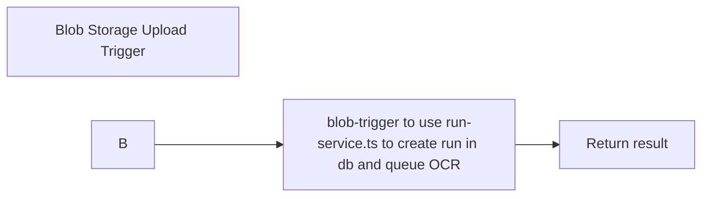

# Processing Runs Architecture

## Overview

This document explains the processing runs architecture for document processing in the VVOCR system. This architecture was designed to support multiple processing attempts, different OCR/AI models, and historical tracking while maintaining clean separation of concerns.

## Core Concepts

### Processing Run

A **processing run** is a single attempt to process a document through the OCR → AI mapping pipeline. Each run is identified by a unique `result_id` (UUID) and represents one complete processing attempt with its own:

- OCR results and metadata
- AI mapping results and metadata
- Processing status and timestamps
- Cost and usage tracking

### Vendor as Primary Identifier

**Vendor name** (`vendor_name`) is the primary business identifier for documents in the system. It follows the pattern:

```
<VENDOR_NAME>_<MM>_<YY>
Example: ACME_CORP_02_26
```

Key characteristics:

- 1-to-1 relationship with documents (currently)
- Used in API routes: `/api/documents/{vendorName}/...`
- Multiple processing runs can exist per vendor
- Enables business-focused API design

### Document Path

The `document_path` identifies the original uploaded PDF file in blob storage:

```
<vendorName>/<filename>.pdf
Example: ACME_CORP_02_26/price-list.pdf
```

Multiple processing runs share the same `document_path` - they're different attempts to process the same uploaded file.

## Database Schema

### document_processing_results Table

Each row represents ONE processing run:

```sql
CREATE TABLE vvocr.document_processing_results (
    result_id UNIQUEIDENTIFIER PRIMARY KEY,     -- Processing run ID
    vendor_name NVARCHAR(255) NOT NULL,          -- Business identifier
    document_path NVARCHAR(MAX) NOT NULL,        -- Blob storage path
    document_name NVARCHAR(MAX),                  -- Original filename

    -- Processing status
    processing_status NVARCHAR(50),               -- pending, ocr_complete, completed, failed
    export_status NVARCHAR(50),                   -- not_exported, confirmed

    -- OCR metadata
    doc_intel_confidence_score FLOAT,             -- OCR confidence (0-1)
    doc_intel_cost_usd FLOAT,                     -- OCR processing cost
    doc_intel_prompt_used NVARCHAR(MAX),          -- OCR configuration

    -- AI mapping metadata
    ai_mapping_result NVARCHAR(MAX),              -- JSON product array
    ai_model_used NVARCHAR(100),                  -- e.g., 'gpt-4o-mini'
    ai_prompt_used NVARCHAR(MAX),                 -- AI extraction prompt
    ai_model_cost_usd FLOAT,                      -- AI processing cost
    ai_confidence_score FLOAT,                    -- AI confidence
    ai_completeness_score FLOAT,                  -- AI completeness

    -- Timestamps
    created_at DATETIME2 DEFAULT GETUTCDATE(),
    updated_at DATETIME2 DEFAULT GETUTCDATE(),
    processing_completed_at DATETIME2,
    exported_at DATETIME2
);
```

**Note:** Previous schema had `parent_document_id` and `reprocessing_count` for versioning. These were removed in Feb 2026 schema cleanup. Each run is now an independent record.

### vendor_products Table

Products exported to production reference their source run:

```sql
CREATE TABLE vvocr.vendor_products (
    product_id INT IDENTITY PRIMARY KEY,
    vendor_name NVARCHAR(255) NOT NULL,
    result_id UNIQUEIDENTIFIER NOT NULL,          -- Which run produced this
    sku NVARCHAR(100),
    product_name NVARCHAR(MAX),
    price FLOAT,
    -- ... other product fields
    FOREIGN KEY (result_id) REFERENCES document_processing_results(result_id)
);
```

This allows tracking which processing run each product came from.

## Blob Storage Structure

### Uploaded PDFs

```
Container: uploads
Path: <vendorName>/<filename>.pdf
Example: ACME_CORP_02_26/price-list.pdf
```

- Stored once per upload
- Shared by all processing runs for that vendor
- Not deleted when individual runs are deleted

### OCR Results

**Current**

```
Container: uploads
Path: <vendorName>/ocr.json
Example: ACME_CORP_02_26/ocr.json
```

**Future** - Not yet implemented

```
Container: uploads
Path: <vendorName>/ocr-<model>.json
Example: ACME_CORP_02_26/ocr-azure.json
         ACME_CORP_02_26/ocr-textract.json
```

**Design Benefits:**

- Multiple OCR models can coexist
- OCR results can be reused across runs
- OCR service can skip processing if result exists
- Different runs can use different OCR sources

## API Endpoints

responsible for:

- Parse HTTP request (headers, params, body)
- Extract protocol-specific data
- Validate request format (not business rules)
- Transform domain response to HTTP response
- Map domain errors to HTTP status codes
- Apply middleware (CORS, auth, rate limiting)
- Call appropriate service method(s) to perform business logic

### Vendor-Based Routes

All document operations use vendor name as the primary identifier:

#### Upload Document

```http
POST /api/documents/upload
Body: multipart/form-data { file, vendorName }
Response: { filePath }
```

**Service Called:** document-service.ts with method `uploadDocument(file, vendorName)`

**Expected Service Behavior:**

- Uploads PDF to blob storage at `{vendorName}/{filename}.pdf`

**TODO: create blob upload trigger in functions/ to use a new run-service.ts in services/ to:**

1. create initial processing run with `document_path` and `vendor_name`.
2. queue OCR processing for new run

This decouples upload from processing and allows multiple runs per vendor.

#### Reprocess OCR

```http
POST /api/documents/{vendorName}/reprocess-ocr
Response: { newRunId }
```

**Service Called:** run-service.ts (to be implemented now) with method `reprocessOCR(vendorName)`

**Expected Service Behavior:**

- Create NEW processing run with same `document_path` and `vendor_name`
- Queue OCR processing for new run
- Return `newRunId` in response
- Original run remains unchanged

**Future Enhancement:**

- Check for `<vendorName>/ocr-<model>.json` in blob storage
- Reuse existing OCR results if available
- Only run OCR if needed for new model

#### Reprocess AI Mapping

```http
POST /api/documents/{vendorName}/reprocess-ai-mapping
Response: { newRunId }
```

**Service Called:** run-service.ts (to be implemented now) with method `reprocessAI(vendorName)`

**Expected Service Behavior:**

- Create NEW processing run with same `document_path` and `vendor_name`, and OCR metadata from latest run (all fields that start with `doc_intel_`)
- Queue AI processing for new run
- Return `newRunId` in response
- Enables comparing different AI models/prompts without re-running OCR

**Future Enhancement:**

```http
POST /api/documents/{vendorName}/reprocess-ai-mapping
Body: { aiModel?: string, aiPrompt?: string }
```

- Accept custom AI model and prompt
- Enable A/B testing of different extraction strategies
- Track which model/prompt worked best

#### Get Results

```http
GET /api/documents?vendorName={vendorName}
Response: [ { result_id, vendor_name, processing_status, ... } ]
```

Returns all processing runs for a vendor, ordered by `created_at DESC`.

### Run-Specific Routes

Operations on individual processing runs use `result_id`:

#### Confirm Mapping

```http
POST /api/documents/runs/{runId}/confirm
Response: { documentId, vendor, }
```

Exports products from specific run to `vendor_products` table. Sets `export_status = 'confirmed'`.

#### Delete Run

```http
DELETE /api/documents/runs/{runId}
Response: { message, runId }
```

Deletes specific processing run from database. Does NOT delete:

- Blob storage files (PDF, OCR results)
- Other runs for same vendor

Use case: Remove failed or superseded processing attempts.

#### Delete Vendor (All Runs)

```http
DELETE /api/documents/{vendorName}
```

**Service Method:** `documentService.deleteByVendorName(vendorName)`

Deletes:

1. Products from `vendor_products` (foreign key constraint)
2. All processing runs for vendor
3. Blob storage files (PDF, OCR results)

## Processing Flow

### 1. Initial Upload

OLD:


NEW:



**Database Record:**

- `result_id`: new UUID
- `vendor_name`: from upload
- `document_path`: generated path
- `processing_status`: 'pending'
- `export_status`: 'not_exported'

### 2. OCR Processing


**Updates Run:**

- `doc_intel_confidence_score`: confidence
- `doc_intel_cost_usd`: OCR cost
- `processing_status`: 'ocr_complete'

**TODO:** save doc_intel_structured_data to `<vendorName>/ocr.json`

### 3. AI Mapping


**Updates Run:**

- `ai_mapping_result`: JSON product array
- `ai_confidence_score`: confidence
- `ai_completeness_score`: completeness
- `ai_prompt_used`: prompt text or identifier
- `ai_model_used`: model name
- `ai_model_cost_usd`: AI cost
- `processing_status`: 'completed'
- `processing_completed_at`: timestamp

### 4. Confirm Mapping


**Updates Run:**

- `export_status`: 'confirmed'
- `exported_at`: timestamp

## Processing Scenarios

### Scenario 1: OCR Processing

**Functionality ATM**

- if no <vendorName>/ocr.json exists in blob storage, process OCR
- if exists, continue without processing

**Future Enhancement:** allow rerunning OCR with new model/config

### Scenario 2: AI Mapping Processing

**Use Case:** Need to try different AI model or prompt without re-running expensive OCR.

**Current Implementation:**

```typescript
// Updates existing run
POST /api/documents/{vendorName}/process-ai-mapping
→ Create new result_id
→ Copy OCR metadata from latest run:
  - doc_intel_extracted_text
  - doc_intel_confidence_score
  - doc_intel_cost_usd
→ Return newRunId
```

**Target Implementation:**

```typescript
// Creates new run with copied OCR
POST /api/documents/{vendorName}/process-ai-mapping
Body: { aiModel?: 'gpt-4', aiPrompt?: 'custom instructions' }

→ Create new result_id
→ Copy OCR metadata from latest run:
  - doc_intel_extracted_text
  - doc_intel_confidence_score
  - doc_intel_cost_usd
→ Run AI mapping with specified model/prompt
→ Return newRunId

// Database state:
// Run 1: completed (original, gpt-4o-mini)
// Run 2: completed (reprocessing, gpt-4)
```

**Benefits:**

- Compare AI models side-by-side
- Test different extraction prompts
- No OCR re-processing cost
- Can confirm best result

### Scenario 3: Multiple Runs Management

**Query runs for vendor:**

```typescript
GET /api/documents?vendorName=ACME_CORP_02_26

Response: [
  {
    result_id: "uuid-1",
    processing_status: "completed",
    ai_model_used: "gpt-4o-mini",
    ai_confidence_score: 0.85,
    created_at: "2026-02-01T10:00:00Z"
  },
  {
    result_id: "uuid-2",
    processing_status: "completed",
    ai_model_used: "gpt-4",
    ai_confidence_score: 0.92,
    created_at: "2026-02-01T11:30:00Z"
  }
]
```

## Implementation Status

### ✅ Implemented

- Vendor-based API routes
- `findLatestByVendor()` repository method
- `getLatestRunByVendor()` service method
- `DELETE /api/documents/runs/{runId}` endpoint
- Multiple runs stored in database
- Run-specific confirmation
- **Storage layer refactoring (Feb 2026)**
  - `checkOCRCache()` in StorageService
  - `downloadPdfForOCR()` in StorageService
  - `uploadOCRResults()` in StorageService
  - `getExistingRunByID()` in DocumentRepository
  - Refactored OCR service to use storage abstractions
  - OCR metadata persistence in blob storage

### ⏳ Partially Implemented

- Reprocessing endpoints exist but update in-place - need to change to create new runs!!!
- No new run creation yet - need to implement in run-service.ts and update queue handlers + blob upload trigger

### ❌ Not Yet Implemented

- Custom AI model/prompt parameters

## Summary

The processing runs architecture enables:

- **Historical Tracking:** Keep all processing attempts
- **Experimentation:** Try different OCR/AI models
- **Cost Optimization:** Reuse OCR results across AI runs
- **Comparison:** Evaluate which approach works best
- **Flexibility:** Add new models without schema changes
- **Clean APIs:** Vendor-based routes for business logic

The architecture is partially implemented. Core concepts (multiple runs, vendor routing) are in place. Next steps are completing reprocessing logic to create new runs instead of updating in-place.
