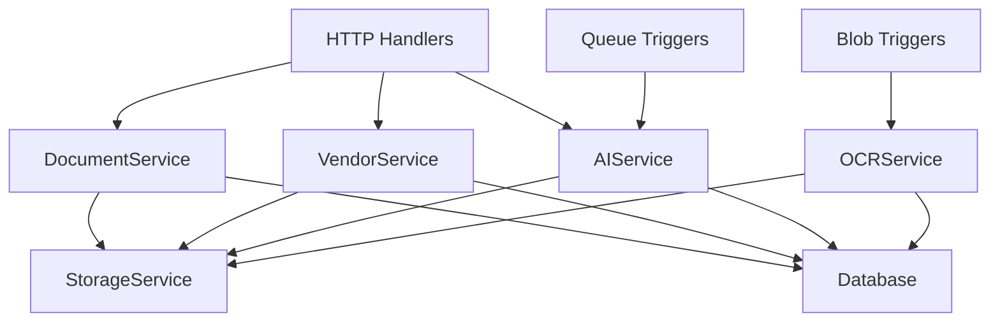

# Service Layer Architecture

**Phase 2 Refactoring - Service Layer Implementation**  
**Status**: ✅ Complete  
**Date**: 2026-01-30

---

## Overview

The service layer provides business logic abstraction for Azure Functions handlers. This refactoring extracts domain logic from HTTP handlers into reusable service classes that can be shared across different trigger types (HTTP, Queue, Blob, Timer).

## Architecture Principles

### Separation of Concerns

- **Handlers**: Thin routing layer (HTTP/Queue/Blob triggers)
- **Services**: Business logic and data orchestration
- **Utils**: Database connections, validation, helpers
- **Middleware**: Cross-cutting concerns (CORS, auth, error handling)

### Benefits

✅ **Code Reuse**: AI mapping logic shared between HTTP endpoint and queue trigger  
✅ **Testability**: Services can be unit tested without HTTP infrastructure  
✅ **Maintainability**: Business logic centralized in focused service classes  
✅ **Scalability**: Easy to add new triggers using existing services

---

## Service Classes

### 1. DocumentService (`src/services/document-service.ts`)

**Responsibility**: Document lifecycle management

**Methods**:

- `upload(vendorName, file)` - Upload and validate PDF documents
- `deleteDocument(documentId)` - Delete document and associated blobs
- `getResults(filters?)` - Query document processing results
- `reprocess(documentId)` - Create new version for reprocessing
- `confirmMapping(documentId)` - Export products to production table

**Dependencies**:

- StorageService (blob operations)
- Database (`withDatabase` helper)
- Validation utilities

**Usage Example**:

```typescript
import { getDocumentService } from './services';

const documentService = getDocumentService();
const result = await documentService.upload('VENDOR_01_26', pdfFile);
```

---

### 2. VendorService (`src/services/vendor-service.ts`)

**Responsibility**: Vendor management

**Methods**:

- `deleteVendor(vendorName)` - Cascade delete all vendor documents

**Dependencies**:

- StorageService (blob deletion)
- Database (`withDatabase` helper)

**Usage Example**:

```typescript
import { getVendorService } from './services';

const vendorService = getVendorService();
const result = await vendorService.deleteVendor('ACME_01_26');
// Returns: { vendorName, documentsDeleted, blobsDeleted }
```

---

### 3. AIService (`src/services/ai-service.ts`)

**Responsibility**: OpenAI GPT-4o product mapping

**Methods**:

- `mapProducts(documentId)` - Extract products from OCR text using AI

**Dependencies**:

- OpenAI client (singleton)
- StorageService (download OCR text)
- Database (`withDatabase` helper)

**Key Features**:

- Streaming response support
- Token usage tracking
- Cost calculation ($0.005/1K prompt, $0.015/1K completion)
- Quality metrics (completeness, confidence scores)

**Usage Example**:

```typescript
import { getAIService } from './services';

const aiService = getAIService();
const result = await aiService.mapProducts('document-uuid');
// Returns: { products, productCount, usage, cost, qualityMetrics }
```

---

### 4. OCRService (`src/services/ocr-service.ts`)

**Responsibility**: Azure Document Intelligence OCR processing

**Methods**:

- `processDocument(blobPath)` - Extract text and tables from PDF
- `queueAIMapping(documentId)` - Add document to AI processing queue

**Dependencies**:

- DocumentAnalysisClient (singleton)
- StorageService (blob download)
- QueueService (AI mapper queue)
- Database (`withDatabase` helper)

**Key Features**:

- Table extraction with markdown formatting
- Bronze-layer storage (audit trail)
- Cost tracking ($0.0015 per page)

---

### 5. StorageService (`src/services/storage-service.ts`)

**Responsibility**: Azure Blob Storage operations

**Methods**:

- `uploadBlob(container, path, buffer)` - Upload file to storage
- `deleteBlob(container, path)` - Delete blob
- `downloadBlob(container, path)` - Download blob content
- `uploadBronzeLayer(vendorName, filename, content)` - Audit trail storage

**Dependencies**:

- BlobServiceClient (singleton)

**Bronze Layer Pattern**:

```
bronze-layer/
  ├── VENDOR_01_26/
  │   ├── original-document.pdf
  │   ├── ocr-structured-data.json
  │   └── ocr-extracted-text.txt
```

---

### 6. VersionService (`src/services/version-service.ts`)

**Responsibility**: Document version history

**Methods**:

- `getHistory(documentId)` - Get all versions of a document
- `deleteRun(documentId, runNumber)` - Delete specific version

**Dependencies**:

- Database (`withDatabase` helper)

---

## Singleton Pattern

All services use the **singleton pattern** to ensure single instance per application lifecycle:

```typescript
let serviceInstance: ServiceClass | null = null;

export function getServiceName(): ServiceClass {
  if (!serviceInstance) {
    serviceInstance = new ServiceClass();
  }
  return serviceInstance;
}
```

**Benefits**:

- Connection pooling (OpenAI, Document Intelligence clients)
- Consistent state across invocations
- Reduced initialization overhead

---

## Error Handling

### Custom Error Properties

Services throw errors with `statusCode` property for HTTP mapping:

```typescript
const error = new Error('Document not found') as Error & { statusCode: number };
error.statusCode = 404;
throw error;
```

### Error Handler Middleware

Catches service errors and maps to appropriate HTTP responses:

```typescript
export function withErrorHandler(handler: Handler): Handler {
  return async (req, context) => {
    try {
      return await handler(req, context);
    } catch (error) {
      const statusCode = (error as any)?.statusCode || 500;

      if (statusCode === 404) {
        return { status: 404, jsonBody: { error: 'Not Found', message: error.message } };
      } else if (statusCode === 400) {
        return errorResponse(error.message, 400);
      } else {
        return errorResponse('Internal Server Error', 500);
      }
    }
  };
}
```

---

## Testing Strategy

### Unit Tests

**Handler Tests** (`test/unit/*.unit.test.ts`):

- Mock service layer
- Test HTTP request/response handling
- Verify middleware composition

**Service Tests** (`test/unit/services/*.unit.test.ts`):

- Mock infrastructure (database, storage, AI clients)
- Test business logic in isolation
- Verify error handling and validation

### Integration Tests

**Full Stack** (`test/integration/*.integration.test.ts`):

- Real database (SQL Server in Docker)
- Real storage (Azurite)
- Real Azure Functions runtime
- Test complete workflows end-to-end

---

## Migration Guide

### Before (Monolithic Handler)

```typescript
export async function uploadHandler(req: HttpRequest, context: InvocationContext) {
  // 100+ lines of business logic mixed with HTTP handling
  const pool = await sql.connect(connectionString);
  const blobClient = containerClient.getBlockBlobClient(path);
  await blobClient.upload(buffer);
  await pool.request().query(sql);
  // ... more infrastructure code
}
```

### After (Service Layer)

```typescript
// Handler: Thin routing layer (15 lines)
async function uploadHandlerCore(req: HttpRequest, context: InvocationContext) {
  const file = await req.formData().get('file');
  const vendorName = req.query.get('vendorName');

  const documentService = getDocumentService();
  const result = await documentService.upload(vendorName, file);

  return successResponse(result);
}

export const uploadHandler = withErrorHandler(withCors(uploadHandlerCore));
```

```typescript
// Service: Business logic (60+ lines)
export class DocumentService {
  async upload(vendorName: string, file: File) {
    // Validate vendor name
    // Validate file type and size
    // Upload to storage
    // Save to database
    // Upload bronze-layer copy
    return { documentId, vendorName, documentPath, ... };
  }
}
```

---

## Test Coverage

### Unit Tests Status

- **Total**: 105 tests
- **Passing**: 96 tests (91.4%)
- **Skipped**: 2 tests
- **Coverage**: All refactored handlers + core service methods

### Integration Tests Status

- **Total**: 45 tests
- **Passing**: 45 tests (100%)
- **Coverage**: Upload, delete, reprocess, confirm, error handling

---

## Dependencies

### Infrastructure Singletons

- `OpenAI` client - GPT-4o API
- `DocumentAnalysisClient` - Azure Document Intelligence
- `BlobServiceClient` - Azure Blob Storage
- `QueueServiceClient` - Azure Storage Queue
- SQL connection pool (via `withDatabase` helper)

### Service Dependencies



---

## Next Steps (Phase 3)

### Folder Reorganization

Move from:

```
src/functions/
  ├── api.ts (1315 lines - MONOLITH)
  ├── aiProductMapper.ts
  ├── documentProcessor.ts
  └── ...
```

To domain-based structure:

```
src/functions/
  ├── http/
  │   ├── documents/
  │   │   ├── upload.ts
  │   │   ├── get-results.ts
  │   │   ├── reprocess.ts
  │   │   └── confirm.ts
  │   ├── vendors/
  │   │   └── delete.ts
  │   └── health/
  │       └── sanity.ts
  ├── queues/
  │   └── ai-product-mapper.ts
  ├── blobs/
  │   └── document-processor.ts
  └── timers/
      └── scheduled-cleanup.ts
```

---

## References

- [Phase 2 Implementation Plan](../../project-management/plan/refactor-azureFunctions-javascript-1.md)
- [Azure Functions Best Practices](https://learn.microsoft.com/azure/azure-functions/functions-best-practices)
- [Service Layer Pattern](https://martinfowler.com/eaaCatalog/serviceLayer.html)
